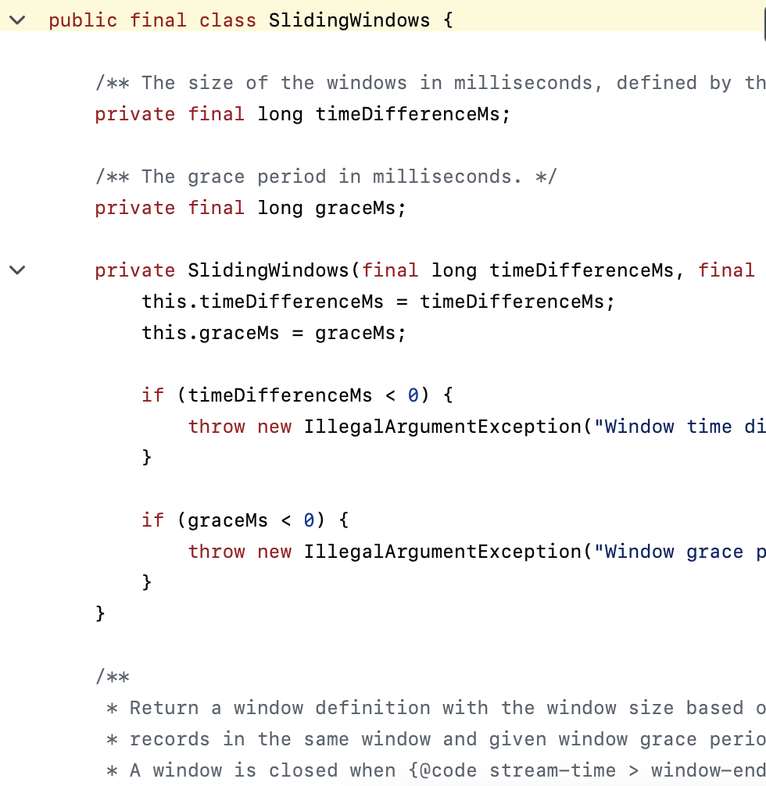

# Sliding Windows

Every Data Structure, every Algorithm, is just an optimization on some naive approach at solving a problem. They're ways to get machines to do things just a bit faster.



Sliding Windows aren't just something to grind to land a software gig. They appear all over the web, from rolling fraud detection to "Last 5 minutes" metrics, real-time joins and analytics, and engineered features for ML systems.

As usual, let's introduce this topic by starting with a problem.

# Rate Limiting

Let's be engineers at Cloudflare, a CDN and reverse-proxy providing website content to edge locations worldwide. Cloudflare doesn't jsut provide faster webpage loading to our customers users, we also provide security. One of our security features is mitigating denial of service attacks against oru customers.

DoS (Denial of Service) happens when a hacker tries to take down our customer's site by overloading our servers with requests for that site. These requests take up so much of our server's bandwidth and time, that actual users can't access the site.

Let's setup some rate limiting.

```
from typing import List

class Solution:
    def throttledRequests(self, requestTimes: List[int], windowSize: int, limit: int) -> int:

        # TODO: implement

        return 0

```

Here, we have a window size `windowSize` and in that window, we can only have `limit` number of requests at the same time.

If our window size is 4, and our limit is 3, then [1,2,3,3,3,3] has two requests dropped (the last two)

## Errors I had on my first few runs:

## Two big bugs, plus a “logic mismatch” with what throttling usually means.

1) Your slice is wrong
```
for request in requestTimes[i:windowSize+1]:
```

That ignores i on the right bound. It should be:

```
for request in requestTimes[i : i + windowSize]:
```

(or i + windowSize / i + windowSize + 1 depending on whether windowSize is a count of items or a time span).

Right now, once i > windowSize+1, the slice becomes empty and you stop counting anything.

2) Off-by-one: you’re not even slicing the intended length
Even if you meant a fixed-length window of `windowSize` items, `i:windowSize+1` is not “windowSize items”; it’s “from i to a constant index”.

3) You’re double-/triple-counting drops across windows (logic issue)
You reset `count = {}` every outer iteration and then increment `droppedRequests` whenever a timestamp’s count exceeds `limit` **within that window.**

That means *the same physical request* can get counted as “dropped” multiple times just because it appears in multiple overlapping windows. Real throttling drops a request `at most once` (at the moment it arrives).
So even after fixing the slice, this approach will typically overcount.

## The Solution

```
from typing import List
from collections import deque

class Solution:
    def throttledRequests(self, requestTimes: List[int], windowSize: int, limit: int) -> int:
        dropped = 0
        window = deque()  # holds timestamps of accepted requests in the active window

        for t in requestTimes:
            # keep only timestamps within the last windowSize seconds (inclusive)
            while window and window[0] <= t - windowSize:
                window.popleft()

            if len(window) >= limit:
                dropped += 1          # drop this request
            else:
                window.append(t)      # accept it

        return dropped
```